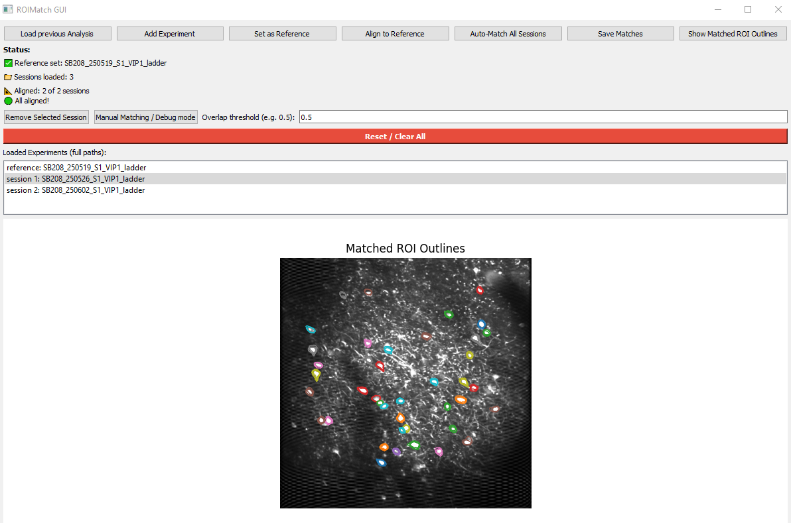

# ROIMatchGUI

**ROIMatchGUI** is an interactive Python GUI for matching ROIs (regions of interest) across multiple two-photon imaging sessions.  
Originally developed for use with Python Suite2p outputs, it supports manual and automatic ROI alignment and tracking over time.

---

## Features

- Manual matching using control points
- Automatic ROI alignment across sessions
- Supports Suite2p Python output
- UUID-based global cell labeling
- Reload previous output to continue or update analyses

---

## Installation

1. Clone the repository:

```bash
git clone https://github.com/YOUR_USERNAME/ROIMatchGUI.git
cd ROIMatchGUI
```


2. Create and activate a Python environment:

```bash
conda create -n roimatchgui python=3.8
conda activate roimatchgui
```

3. Install dependencies and the package

```bash
pip install -r requirements.txt
pip install -e .
```

## Example Data
This repo includes an example dataset in the example_data/ folder that you can use to test the GUI.
It includes a neurons from a mouse with three imaging sessions and precomputed match results.


## Usage
Launch the GUI with:

```bash
roimatchgui
```
or 

```bash
python -m roimatch_gui
```

### Load Suite2p sessions:

- Click "Load Session" to add a sessions' suite2p output (e.g. 'plane0') folder.
- Each loaded session will appear in the session list.

### Set reference session:

- Select a session and choose "Set as Reference". This will be the fixed session for alignment.

### Align to reference:

- Select a sessions "Align to Reference" to open a control point selection window.
- Click corresponding landmarks in both images to define a transformation. 
- You can view the side by side images full screen, zoom in/out and move the images synchronously with the 'Pan' tool. 
- Mislabeled points can be removed with the 'Undo' button 
- 'Reset view' resets the field of view in both images
- It is recommended to label at least 6 corresponding pairs.
- Click 'DONE'. This computes the geometric transform to align the images

- Repeat for all sessions to be aligned to the reference session


### Run automatic ROI matching:

- After aligning all sessions, click "Auto-Match ROIs". 
- You can adjust the 'Overlap threshold' - ranging 0.0 - 1.0 - to be more (1.0) or less (0.0) strict about the required spatial overlap across sessions
- This detects overlapping ROIs across aligned sessions and groups them by shared identity.

### Review matches:

- Click 'Show Matched ROI Outlines': The GUI displays outlines and matched ROIs across sessions for review.

### Save match results:

- Click "Save Matches" to export matched ROI groups.

### Output includes:

- A ```.csv``` file mapping global cell UUIDs to session ROI indices
- A ```.pkl``` file with detailed match metadata for further use. This can be reloaded with 'Load previous Analyses'



## Author
👩‍🔬 Sonja Blumenstock
